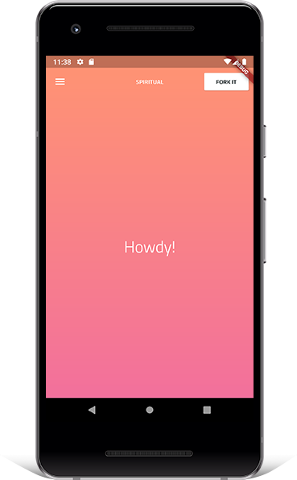
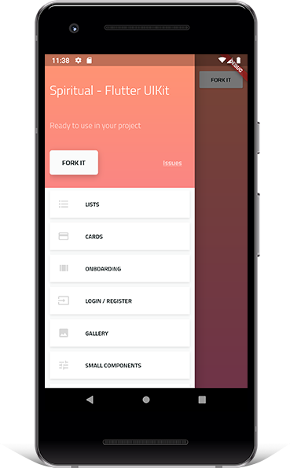
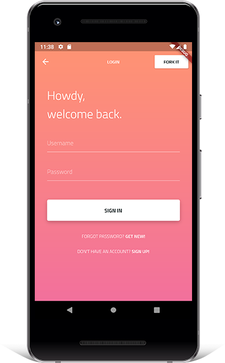
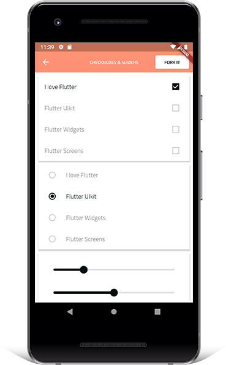
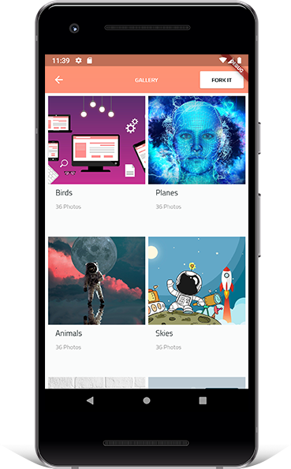
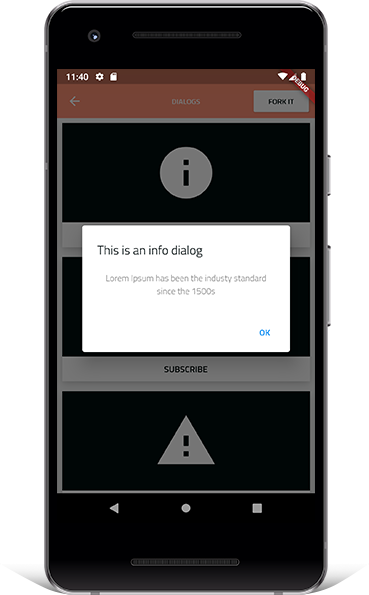

# Spiritual - Flutter UI Kit

<a href='https://play.google.com/store/apps/details?id=com.appbuff.spiritual.flutteruikit'></a>

The beauty of building apps with Flutter is that it allows you to build Android and iOS apps all from one codebase. With Flutter, you write code once in Dart, and run it on multiple platforms.

Widgets play an essential role in creating and declaring user interface. Apps designed & developed with Flutter have a transparent UI and provide users with a delightful experience. The goal of this project is to provide an ultimate collection of app's UIs.

While I built Spiritual UI Kit for my own needs, it is also intented to showcase good app structure and a clean, well-organized Flutter codebase.

The source code is **100% Dart**, and everything resides in the [/lib](https://github.com/shameemreza/spiritual/tree/master/lib) folder.

[](https://opensource.org/licenses/Apache-2.0)
[](https://github.com/shameemreza/spiritual/blob/master/licence.txt)

## Available screens and widgets:

- Button
- Card: Album, Follow, Post, Profile, Rates, User
- Input Field
- List
- Separator
- Dialogs
- Darg and Drop
- Expandable
- Follow
- Login
- Register
- Forget Password
- Parallax
- Parallax Content
- Profile
- Rating
- Splash
- Swipe to dismiss
- Onboarding
- Localization
- Menu
- Top bar

# Screenshots

   

## License

```
Copyright 2020 Shameem Reza

Licensed under the Apache License, Version 2.0 (the "License");
you may not use this file except in compliance with the License.
You may obtain a copy of the License at

   http://www.apache.org/licenses/LICENSE-2.0

Unless required by applicable law or agreed to in writing, software
distributed under the License is distributed on an "AS IS" BASIS,
WITHOUT WARRANTIES OR CONDITIONS OF ANY KIND, either express or implied.
See the License for the specific language governing permissions and
limitations under the License.

## Getting Started

For help getting started with Flutter, view our online
[documentation](https://flutter.io/).
```
